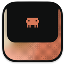

<div align="center">
  
  <h3 align="center">Delicious Island</h3>
  <p align="center">
    A macOS menu bar app that brings Dynamic Island-style notifications to Claude Code CLI sessions.
    <br />
    <em>Fork of <a href="https://github.com/farouqaldori/claude-island">farouqaldori/claude-island</a> with enhanced features</em>
    <br />
    <br />
    <a href="https://github.com/Grokr-Labs/delicious-island-pe/releases/latest" target="_blank" rel="noopener noreferrer">
      
    </a>
    <a href="#" target="_blank" rel="noopener noreferrer">
      
    </a>
  </p>
</div>

## What's New in This Fork

- **Approval Button Animations** — Visual feedback with tooltips showing Claude Code terminal options
- **Settings UI Enhancements** — Hover effects, click animations, and tooltips for better UX
- **Sparkle Auto-Updates** — Automatic update checking with delta downloads
- **Semantic Versioning** — Automated releases with conventional commits
- **Multi-Screen Support** — Select which display shows the notch overlay
- **Improved Notification Settings** — Configurable sounds and expansion behavior

## Features

- **Notch UI** — Animated overlay that expands from the MacBook notch
- **Live Session Monitoring** — Track multiple Claude Code sessions in real-time
- **Permission Approvals** — Approve or deny tool executions directly from the notch
- **Chat History** — View full conversation history with markdown rendering
- **Auto-Setup** — Hooks install automatically on first launch
- **Transcript Path Display** — Shows Claude Code transcript location for reference

## Requirements

- macOS 15.6+
- Claude Code CLI

## Install

Download the latest release or build from source:

```bash
xcodebuild -scheme DeliciousIsland -configuration Release build
```

## How It Works

Delicious Island installs hooks into `~/.claude/hooks/` that communicate session state via a Unix socket. The app listens for events and displays them in the notch overlay.

When Claude needs permission to run a tool, the notch expands with approve/deny buttons—no need to switch to the terminal.

## Privacy

Delicious Island does not collect any analytics or telemetry data.

## License

Apache 2.0 — See [LICENSE](LICENSE) for details.

## Attribution

This project is a fork of [farouqaldori/claude-island](https://github.com/farouqaldori/claude-island). Original work Copyright 2025 Farouq Aldori. Thank you for creating the foundation that made this enhanced version possible.
